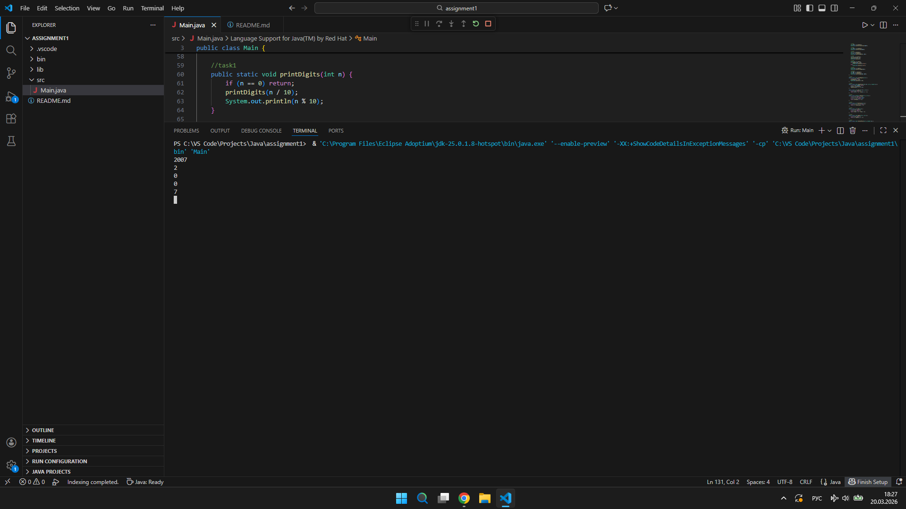
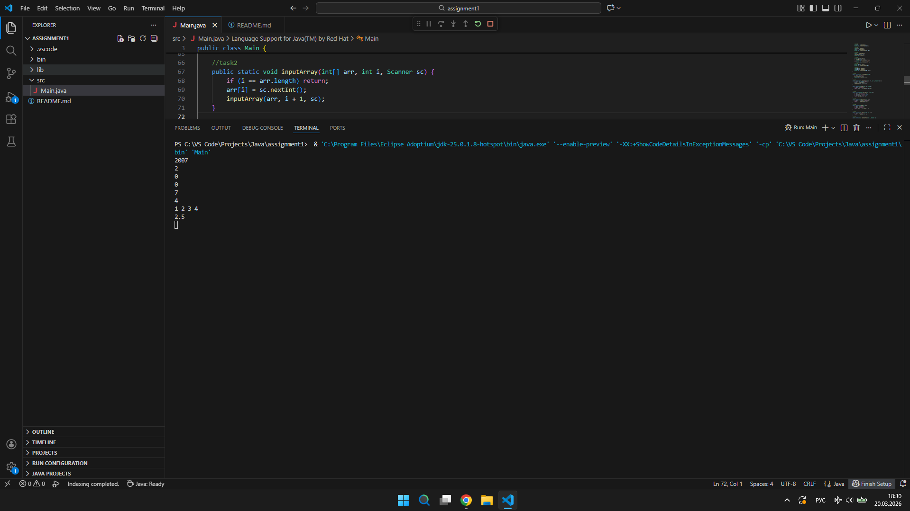
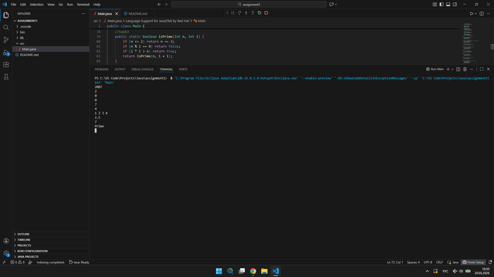
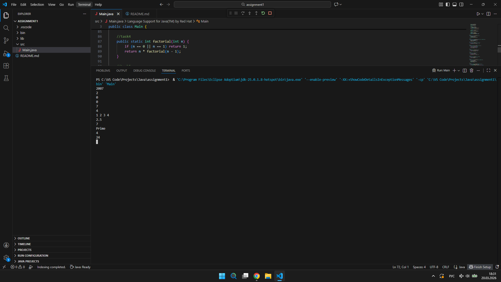
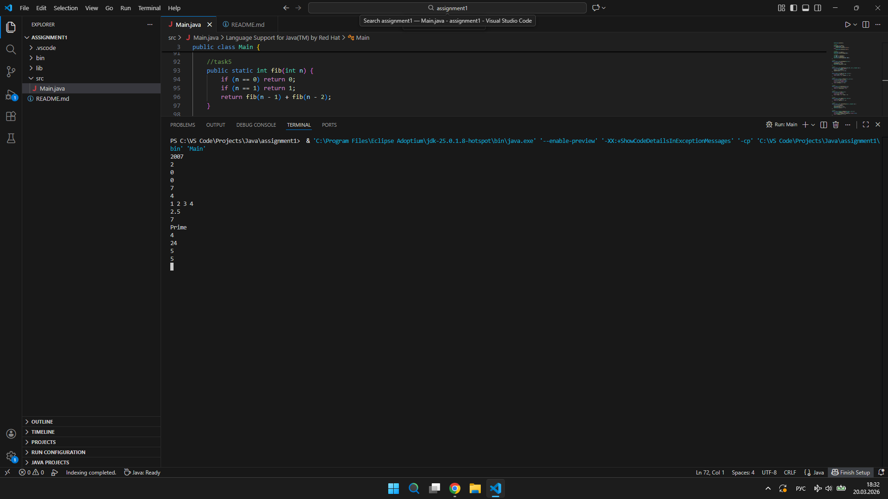
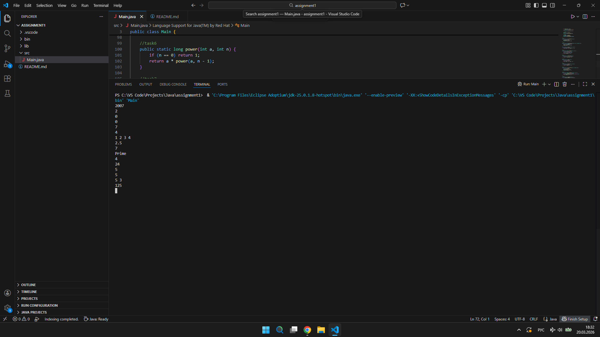
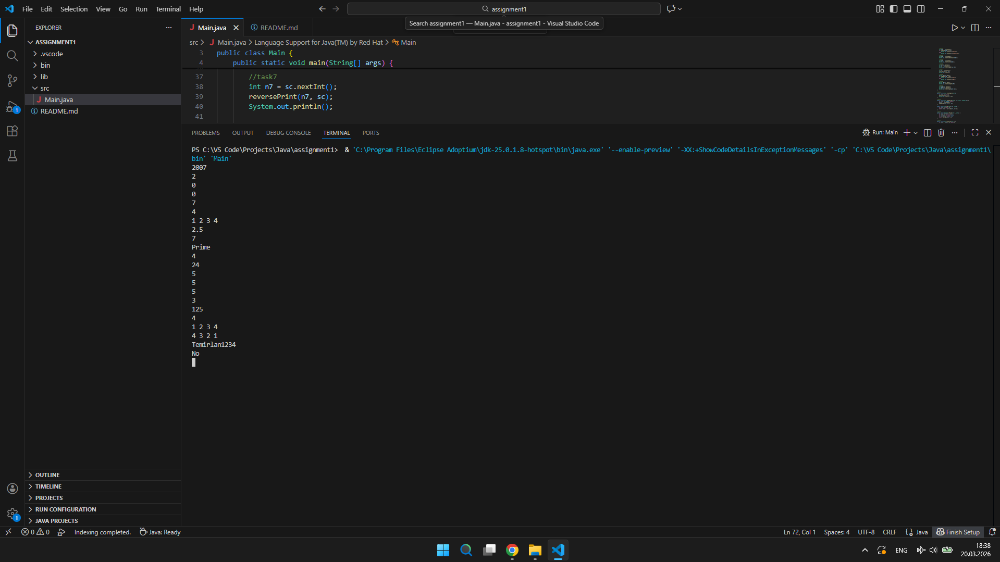
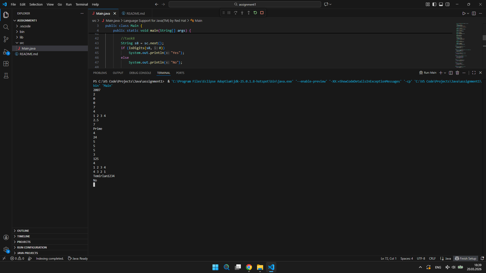
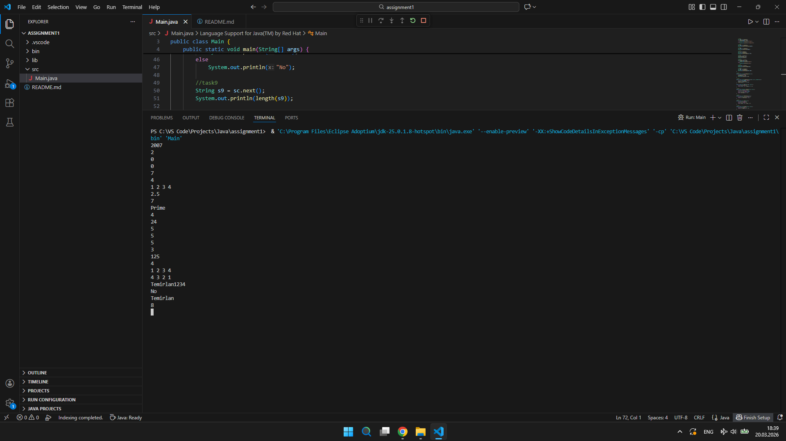
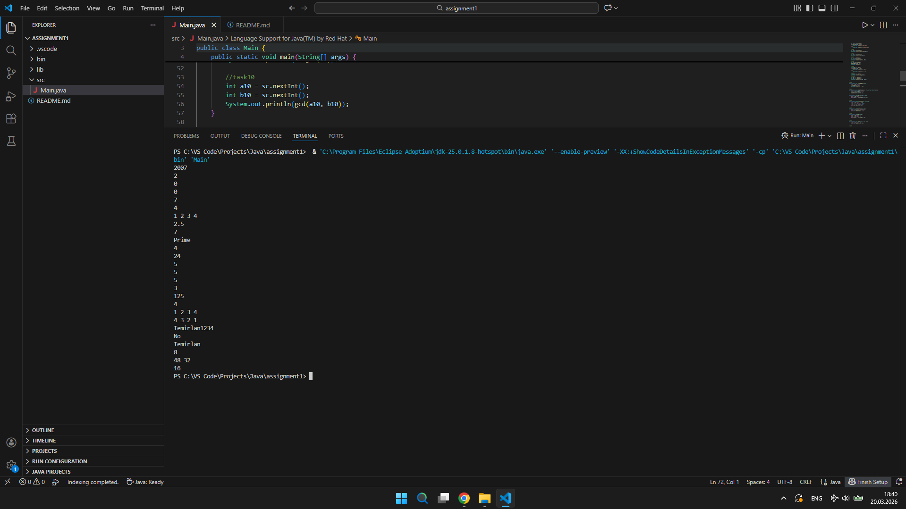

# Assignment 1 - Recursion

# Student Information
Name: Temirlan Tynybekov 
Group: SE-2514 

# Introduction

In this assignment, I worked with recursion in Java.  
The main goal was to solve different problems without using loops, only recursive functions.

I implemented tasks with numbers, arrays, and strings. This helped me understand how recursion works step by step.

# Task 1 – Print Digits of a Number

This function prints each digit of a number on a new line.  
It divides the number and prints digits after recursive calls.

# Task 2 – Average of Elements

I used recursion to calculate the sum of array elements.  
Then I divided the sum by the number of elements to get the average.

# Task 3 – Prime Number Check

This function checks if a number is prime.  
It tests if the number is divisible by other numbers using recursion.

# Task 4 – Factorial

This function calculates factorial using recursion.  
Each call multiplies the number by the result of the next call.

# Task 5 – Fibonacci Number

This function finds the n-th Fibonacci number.  
It uses the formula F(n) = F(n-1) + F(n-2).

# Task 6 – Power Function

This function calculates a number raised to a power.  
It multiplies the number recursively.

# Task 7 – Reverse Output

This function reads numbers and prints them in reverse order.  
It first reads input, then prints values after recursive calls.

# Task 8 – Check Digits in String

This function checks if all characters in a string are digits.  
If one character is not a digit, it returns "No".

# Task 9 – Count Characters in a String

This function counts the number of characters using recursion.  
It removes one character at each step.

# Task 10 – Greatest Common Divisor (GCD)

This function finds GCD using Euclidean algorithm.  
It calls itself with smaller numbers until one becomes zero.

# Conclusion

In this assignment, I learned how recursion works in Java.  
I understood the importance of base case and recursive calls.  

At first, it was a bit confusing, but after practice, I understood how the function calls itself and returns values.

This assignment helped me improve my problem-solving skills.
